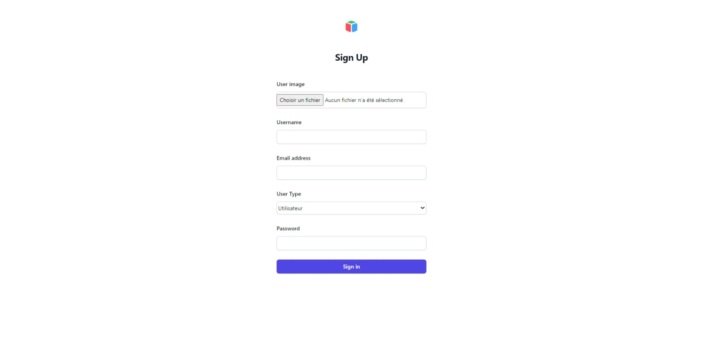
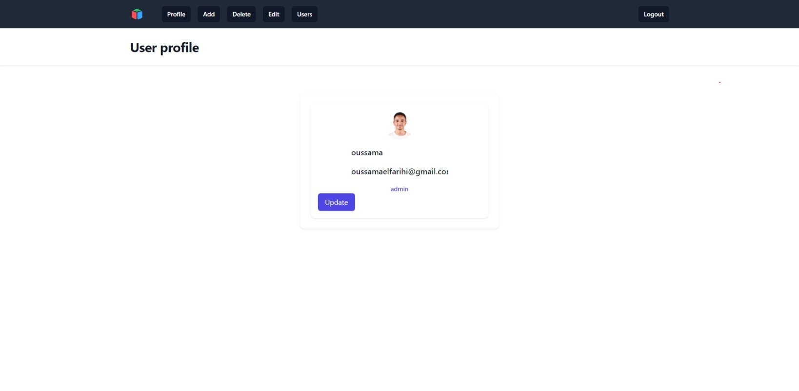
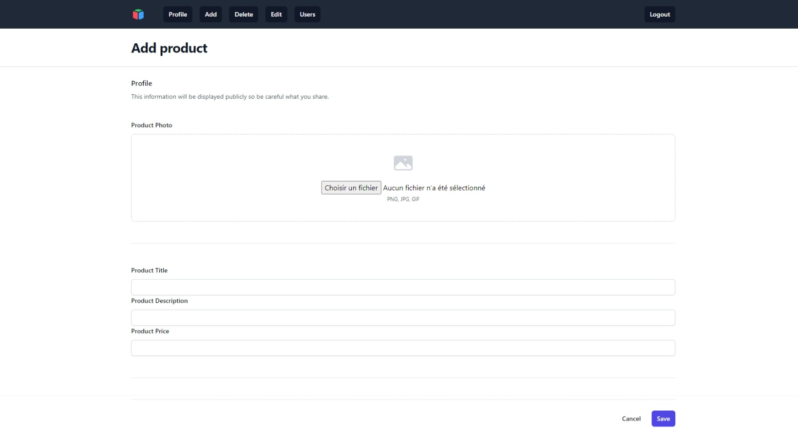
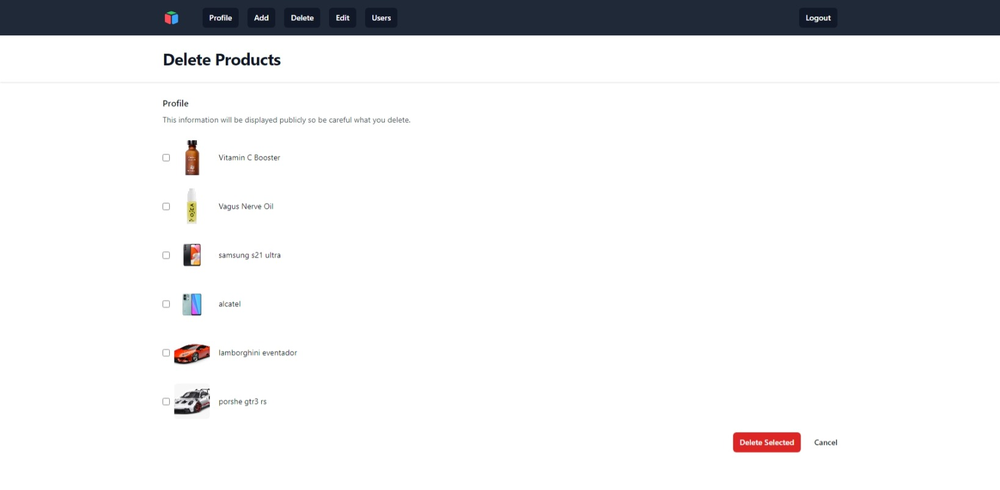
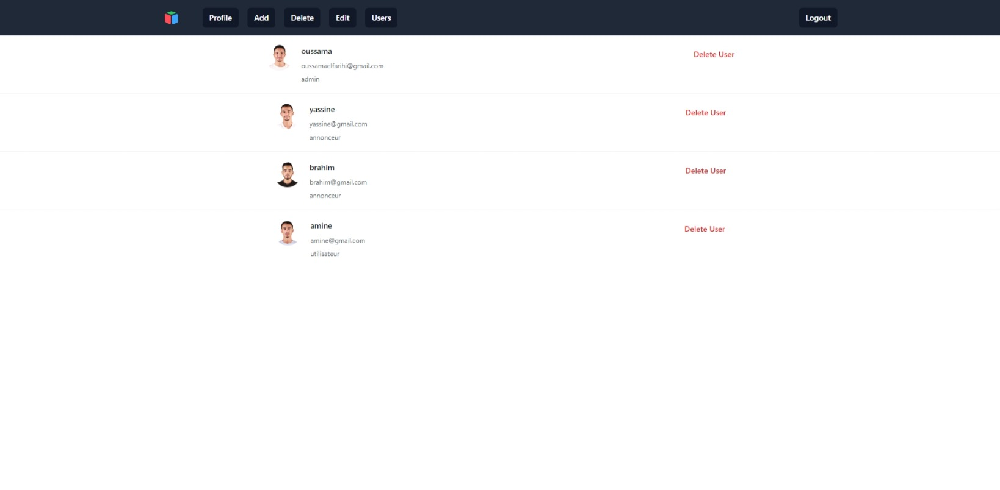

# Projet de Refactoring Avito

## Aperçu

Avito optimise son site d'annonces en affinant ses structures grâce à une modélisation avancée et une programmation PHP/MySQL simplifiée. Cette démarche s'appuie sur les succès antérieurs en modélisation, illustrant l'engagement continu de l'entreprise envers le développement.

## Structure du Projet

### 1. Diagramme de Cas d'Utilisation

- Link : `https://lucid.app/lucidchart/2065dcf9-484f-4be0-9aff-39d74e7d17d9/edit?viewport_loc=-2218%2C-822%2C1703%2C757%2C0_0&invitationId=inv_8349440e-f9d1-43a6-86a0-16a3e38fff88`

Description : Ce fichier contient le diagramme de cas d'utilisation illustrant les diverses interactions entre les utilisateurs et le système.

### 2. Diagramme de Classes

- Fichier : `https://lucid.app/lucidchart/2065dcf9-484f-4be0-9aff-39d74e7d17d9/edit?viewport_loc=-2218%2C-822%2C1703%2C757%2C0_0&invitationId=inv_8349440e-f9d1-43a6-86a0-16a3e38fff88`

Description : Ce fichier contient le diagramme de classes décrivant les classes essentielles et leurs relations pour le site Avito annonces.

### 3. Initialisation de la Base de Données

#### Fichiers :

- `connection.php`
- `db.sql`

Description : Ces fichiers contiennent le code PHP et MySQL nécessaire pour initialiser la base de données en fonction des modèles précédemment définis. Assurez-vous d'avoir une configuration correcte du serveur MySQL.

### 4. Sing up

#### Fichier :

- `singup.php`

Description : Ce fichier inclut le code PHP pour créer un compte sur ce site à l'aide d'un formulaire. L'utilisateur saisit son nom, son e-mail, une photo de profil, le type d'utilisateur souhaité, puis un mot de passe. Ce code déchiffre le mot de passe pour une sécurité accrue des utilisateurs.

### 5. Login

#### Fichier :

- `login.php`

Description : Ce fichier contient le code PHP permettant de se connecter à ce site. Chaque type d'utilisateur est redirigé vers le tableau de bord qui lui est spécifiquement adapté.

### 6. Insertion de Données

#### Fichier :

- `dashboard.php`

Description : Ce fichier inclut le code PHP pour insérer des données dans la base de données à l'aide d'un formulaire. Les utilisateurs peuvent interagir avec le formulaire pour ajouter de nouvelles entrées dans le système.

### 5. Suppression de Données

#### Fichier :

- `delete.php`

Description : Ce fichier inclut le code PHP pour supprimer des entrées spécifiques (`delete.php`).

### 6. Modification de Données

#### Fichier :

- `edit.php`

Description : Ce fichier contient le code PHP pour modifier des données existantes dans la base de données. Les utilisateurs peuvent interagir avec cette fonctionnalité pour modifier des informations selon leurs besoins.

### 7. Gestion d'utilisateur

#### Fichiers :

- `users.php`

Description : Ce fichier permet à l'administrateur du site de gérer les utilisateurs, en ayant la possibilité de supprimer des utilisateurs ou de modifier le rôle de chacun. Lorsqu'un administrateur supprime un utilisateur, les annonces de cet utilisateur sont automatiquement supprimées.

### 8. Profile

#### Fichiers :

- `profile.php`

Description : Ce fichier est le premier à s'afficher lorsque l'utilisateur se connecte. Dans cette page, il peut voir son profil, sa photo, son nom, son e-mail et son rôle. De plus, l'utilisateur a la possibilité de modifier son nom et son e-mail.

### 9. Application Principale

#### Fichiers :

- `index.php`

Description : Le fichier principal pour le site Avito annonces. Il devrait inclure le code nécessaire pour l'interaction utilisateur et la présentation des données. Assurez-vous que tous les autres fichiers et fonctionnalités sont inclus correctement.

### 10. Produits

#### Fichiers :

- `product.php`

Description :  Le fichier est conçu pour afficher tous les produits ajoutés sur ce site par les utilisateurs.

### 11. Affichage du Site Web

#### Captures d'Écran :

*Page d'accueil du site Avito*

*Exemple de la page des produits*

*Exemple de la page du login*

*Exemple de la page du sing up*

*Exemple de la page de profile*

*Exemple de la page d'ajoute des produits*

*Exemple de la page de suppression des annonces*

*Exemple de la page de modification des annonces*

*Exemple de la page d'affichage et suppression des utilisateurs*

## Utilisation

1. Clonez le dépôt : `git clone https://github.com/Youcode-Classe-E-2023-2024/Oussama_el_farihi_Avito_v2.git`
2. Configurez votre serveur MySQL et ajustez les informations d'identification dans `connection.php`.
3. Exécutez les scripts SQL dans `db.sql` pour initialiser la base de données.
4. Accédez au fichier `index.php` dans un navigateur web pour interagir avec le site Avito annonces.

## Contributeurs

- [Elfarihi Oussama]

N'hésitez pas à contribuer au projet en soumettant des pull requests ou en signalant des problèmes.

## Licence

Consultez le fichier [LICENSE.md](LICENSE.md) pour plus de détails.
